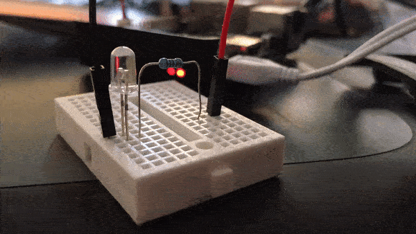

# Aldis

A morse code twitter client for the Raspberry Pi.

## Installation

1.  Clone the repository
2.  `cd` into the relevant directory
3.  Run `npm install`

## Configuration
The following instructions are for making configuration changes to the `config.json` file.

1.  Create twitter consumer API keys and access tokens by creating a new twitter app at [developer.twitter.com](https://developer.twitter.com/).
2.  Add these credentials to the `twitter: { credentials }` object's relevant properties.
3.  Set the `led_pin` property to the GPIO pin number to which the LED is attached to your Raspberry Pi.
4.  Set the `wordsPerMinute` property to the rate at which you wish messages to be encoded.
5.  Per Twitter's [Streaming Filter API](https://developer.twitter.com/en/docs/tweets/filter-realtime/guides/basic-stream-parameters.html), the `twitter: follow` and `twitter: track` properties are string arrays that allow one to filter the tweet stream. Array elements are processed into comma separated values.

## Usage

1.  Connect an LED to the pin relating to the what was set at the configuration stage. N.B. I recommend connecting the LED through at least a 330Ω resistor so as not to blow either the LED or GPIO pin.
2.  Run `node index.js`
